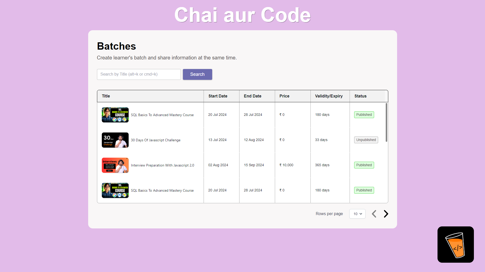

# Assignment 1

## Overview

This project consists of three main tasks:
1. **OTP Form**: A form to input and verify an OTP.
3. **Course List Draggable**: A list displaying a list of courses, can be reordered using drag and drop.
2. **Batches Table**: A list of batches with pagination and search feature.

## Table of Contents
- [Installation](#installation)
- [Usage](#usage)
- [Features](#features)
  - [OTP Form](#otp-form)
  - [Course List Draggable](#course-list-draggable)
  - [Batches Table](#batches-table)
- [Screenshots](#screenshots)
- [Technologies](#technologies)
- [License](#license)

## Installation

1. Clone the repository:
    ```sh
    git clone https://github.com/Git21221/masterji-assignment1.git
    ```
2. Navigate to the project directory:
    ```sh
    cd masterji-assignment1
    ```
3. Install dependencies:
    ```sh
    npm install
    ```
4. Start the development server:
    ```sh
    npm run dev
    ```

## Usage

- Navigate to `/otp-form` to use the OTP form.
- Navigate to `/course-list` to view the draggable course list.
- Navigate to `/batches` to view the batches table.

## Features

### OTP Form

- **Route**: `/otp-form`
- **Functionality**: A form to input an OTP and verify it against a preset value (`1234`).
- **Validation**:
  - The OTP must be exactly 4 digits long.
  - The OTP must match the preset value (`1234`).
- **Hosted Route**: https://assignment-masterji.netlify.app/otp-form

### Course List Draggable

- **Route**: `/course-list`
- **Functionality**: A table displaying a list of courses that can be reordered using drag and drop.
- **Hosted Route**: https://assignment-masterji.netlify.app/course-list

### Batches Table

- **Route**: `/batches`
- **Functionality**: A list of batches in a table with pagination and search feature.
- **Hosted Route**: https://assignment-masterji.netlify.app/batches

## Screenshots

### OTP Form


### Course List Draggable


### Batches Table



## Technologies

- React
- React Router
- JavaScript (ES6+)

## License

This project is licensed under the MIT License. See the [LICENSE](LICENSE) file for details.
